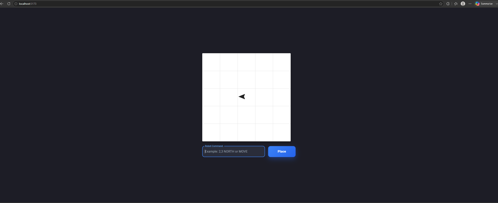
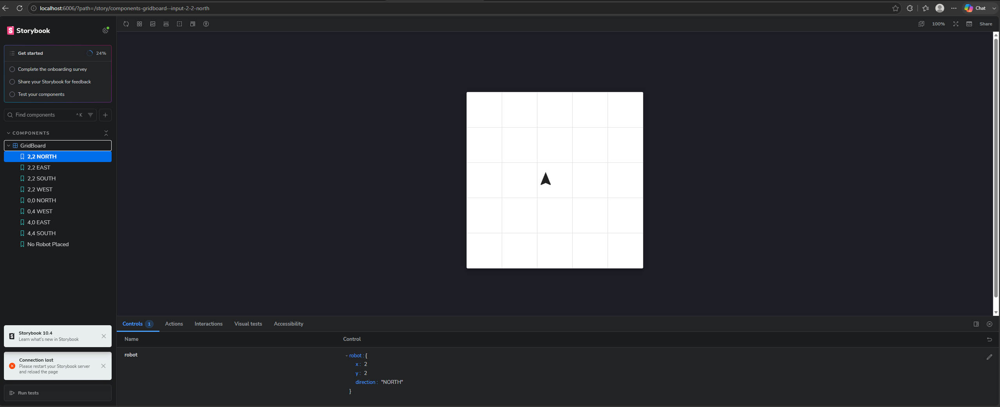

# Object Grid Placement

A React application that visualizes the placement of a Object on a **5×5 grid** based on user commands. The project was developed as part of a frontend assessment using **React**, **Material UI**, and **Storybook**.

---

## Application Preview

### Main Application



---

##Features

- Visualize a Object on a fixed **5×5 grid**
- Place the Object using coordinates and direction
- Rotate the Object to face:
  - NORTH
  - EAST
  - SOUTH
  - WEST
- Execute Object commands:
  - `MOVE`
  - `LEFT`
  - `RIGHT`
  - `REPORT`
- Prevent the Object from moving outside the board
- Validate user input with friendly error messages
- Keyboard shortcut (**Enter**) to execute commands
- Automatic focus on the command input
- Storybook stories demonstrating different Object positions and edge cases

---

## Sample Commands

### Place the Object

```text
2,3 NORTH
```


---

### Move the Object

```text
MOVE
```


---

### Report Position

```text
REPORT
```

Displays the Object's current position in a notification and logs the position to the browser console.


---

### Invalid Command

```text
HELLO
```

The application validates user input and displays an error notification.


---

## Storybook

The project includes Storybook to document and demonstrate the `GridBoard` component under different scenarios.



Stories include:

- 2,2 NORTH
- 2,2 EAST
- 2,2 SOUTH
- 2,2 WEST
- 0,0 NORTH
- 0,4 WEST
- 4,0 EAST
- 4,4 SOUTH
- Empty Grid

---

## Technologies

- React
- Vite
- Material UI
- Storybook

---

## Getting Started

### Install dependencies

```bash
npm install
```

### Run the application

```bash
npm run dev
```

Open:

```
http://localhost:5173
```

---

## Storybook

Run Storybook locally:

```bash
npm run storybook
```

Open:

```
http://localhost:6006
```

---

## Project Structure

```text
src/
├── components/
│   ├── GridBoard/
│   ├── GridCell/
│   └── ObjectMarker/
├── helpers/
│   ├── executeCommand.js
│   ├── parseInput.js
│   └── validateInput.js
├── stories/
├── App.jsx
├── App.css
├── index.css
└── main.jsx
```

---

## Supported Commands

### Placement

```text
2,3 NORTH
0,0 WEST
4,4 SOUTH
```

### Object Commands

```text
MOVE
LEFT
RIGHT
REPORT
```

---

## Notes

- Coordinates range from **0** to **4**.
- The bottom-left corner of the board represents **(0,0)**.
- Object movement outside the board is ignored.
- Commands are **case-insensitive**.
- Invalid commands display a user-friendly notification.

---

## Author

Developed by **Jayvee Molino** as part of a frontend assessment.
